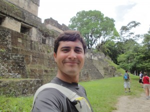

# Your watchmen have turned against you, or Why 25% (or more) of your tests are junk and what you can do about it.

I present research results that show a link between test redundancy and bugs in Ruby projects. Even when 100% code coverage has been attained, redundancy actually diminishes the regression detection capability of your tests, leaving projects exposed to test escapes during its evolution. Test redundancy increases test maintainability and execution costs as well. But how do you detect redundant tests? How do you find and deal effectively with them? This talk presents a new solution that quickly finds how redundant your test suite really is.

Audience will learn:
* The state of test suites in Ruby open-source projects.
* How code coverage can be misleading in assessing test quality.
* How redundant tests increase the risk and cost of testing.
* An introduction into a solution to assess how good a test suite really is.
* Terminology and definitions to communicate effectively about test quality.

## Mario Gonzalez Macedo

I started working on the unified theory of testing since college. At IBM, I got a chance to expand it and apply it, especially when working with customers for root-cause analysis in our enterprise storage products, as well as in development. Reachability graphs was one result of my work.

After IBM, I formed my own company called Ortask, where I now focus my attention developing tools that make testers more efficient, as well as researching/evangelizing testing techniques that have shown to yield high-quality results. Not surprisingly, I use both the theory and the tools quite often in my own testing.

I'm also currently writing a book that explains the unified theory of testing and all its useful details. the book will hopefully be available some time in 2014.

- [website](http://ortask.com)
- [twitter](https://twitter.com/maramono)
- [blog](http://ortask.com/blog)
- [screencasts](http://www.youtube.com/user/TheOrtaskTeam)

